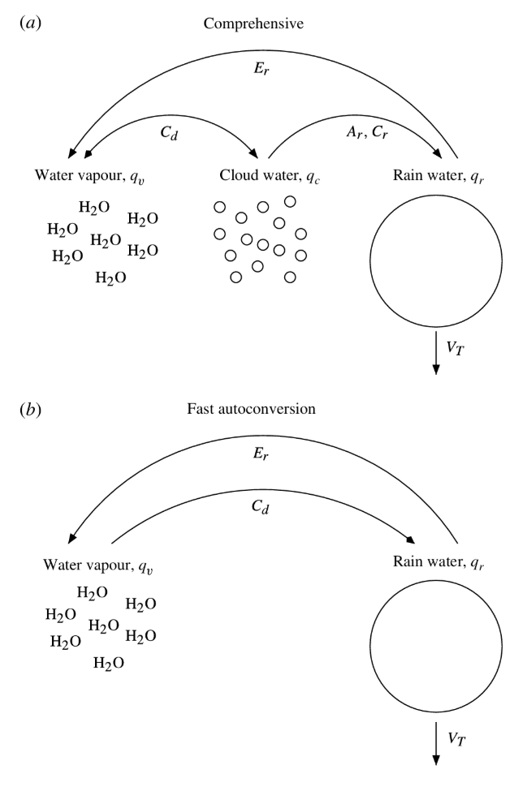
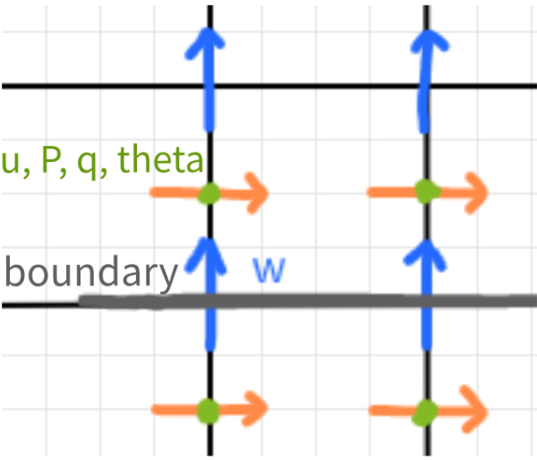

# Physical Formulation

The model is built on the Moist Boussinesq Approximation, utilizing the Fast Autoconversion (FARE) limit for bulk microphysics. 

### Governing Dynamics
The core system evolves the velocity vector $\vec{u}$, pressure $P$, rainy potential temperature $\theta_r$, and total water mixing ratio $q_t$. The equations are expressed using the material derivative $\frac{\mathrm{D}}{\mathrm{D}t} = \frac{\partial}{\partial t} + \vec{u} \cdot \nabla$.

$$
\begin{align}
\frac{\mathrm{D}\vec{u}}{\mathrm{D}t} = -\frac{1}{\rho}\nabla P + \hat{k} b(\theta_r, q_t, z) \\
\nabla \cdot \vec{u} = 0 \\
\frac{\mathrm{D}\theta_r}{\mathrm{D}t} + \frac{L}{c_p} V_T \frac{\partial q_r}{\partial z} = 0 \\
\frac{\mathrm{D}q_t}{\mathrm{D}t} - V_T \frac{\partial q_r}{\partial z} = 0
\end{align}
$$

#### Diagnostic Relations
The model relies on the following diagnostic relationships to relate potential temperature ($\theta$), equivalent potential temperature ($\theta_e$), rainy potential temperature ($\theta_r$), and the water vapor content ($q_t, q_v, q_r$).

$$
\begin{align}
\theta_e &= \theta + \frac{L}{c_p} q_v \\
\theta_r &= \theta - \frac{L}{c_p} q_r \\
q_r &= max(q_t - q_{vs}, 0) \\
q_v &= min(q_t, q_{vs})
\end{align}
$$

#### Buoyancy Formulation
Buoyancy ($b$) is determined by a piecewise function depending on whether the total water mixing ratio ($q_t$) has reached the saturation threshold ($q_{vs}$). It relies on the background states for potential temperature $\tilde{\theta}(z)$ and water vapor $\tilde{q}_v(z)$.

$$
\begin{equation}
b = g
\begin{cases}
\frac{\theta_r - \tilde{\theta}(z)}{\theta_o} + \varepsilon_o(q_t - \tilde{q}_v(z)) & \text{if } q_t < q_{vs} \\
\frac{\theta_r - \tilde{\theta}(z)}{\theta_o} + \left(\frac{L}{c_p\theta_o} - 1\right)(q_t - q_{vs}(z)) + \varepsilon_o(q_{vs}(z) - \tilde{q}_v(z)) & \text{if } q_t \geq q_{vs}.
\end{cases}
\end{equation}
$$

#### Diffusion and Hyperdiffusion
In addition to the inviscid equations above, we also introduce artificial vertical diffusion ($\nu_{art}$) and horizontal hyperdiffusion ($\gamma_{art}$) to the right-hand side of the prognostic equations for momentum ($u, w$) and scalars ($\theta_r, q_t$) to smoothen high-frequency spectral noise:

$$
\mathcal{D} = \nu_{art} \frac{\partial^2 }{\partial z^2} - \gamma_{art} \frac{\partial^4 }{\partial x^4}
$$

 
 

# Numerical Scheme

## Spatial Implementation

### Horizontal Pseudo-spectral Fourier Galerkin with 3/2 dealiasing
Horizontal derivatives are computed in spectral space, where $k$ is the wavenumber. 

$$
\begin{align}
\partial_x \hat{u}_k &= i k \hat{u}_k \\
\partial_x^2 \hat{u}_{k,j} &= -k^2 \hat{u}_{k,j}
\end{align}
$$

Note: Calculating nonlinear terms such as advection and piecewise scalars ($b, q_r$) requires transforming them to physical space; however, doing this naively can cause energy from unresolved wavenumbers to accumulate in the highest resolvable wavenumbers (aliasing). To address this, we remove said energy (dealiasing) through 3/2 zero-padding:
1. Add a 1/2 zero pad symmetrically (1/4 to the upper wavenumber bound and 1/4 to the negatve lower wavenumber bound).
2. Transform to physical space using an inverse FFT.
3. Compute the term in physical space.
4. Transform back into spectral space using an FFT.
5. Dealias by removing the padded section.

 

### Vertical 2nd-order Staggered Centered Differences
Vertical derivatives are computed using finite differences on a staggered C-grid.

$$
\begin{align}
\partial_z \hat{u}_{k,j} &\approx \frac{\hat{u}_{k,j+1} - \hat{u}_{k,j-1}}{2\Delta z} = \frac{\hat{u}_{k,j+1/2} - \hat{u}_{k,j-1/2}}{\Delta z} \\
\partial_z^2 \hat{u}_{k,j} &\approx \frac{\hat{u}_{k,j+1} - 2\hat{u}_{k,j} + \hat{u}_{k,j-1}}{\Delta z^2}
\end{align}
$$

Note: Because the FFT is a linear transform, applying it horizontally won't affect the linear operators in the vertical direction, allowing us to treat the vertical direction purely with finite differences.

 

#### Nonlinear Advection
To ensure stability and conservation, advection is formulated differently depending on the variable:

$$
\begin{align}
u \cdot \nabla \theta &= \nabla \cdot (u\theta) \quad \text{(Flux form for } \theta_r, q_t \text{)} \\
u \cdot \nabla v &= \frac{1}{2}(\nabla \cdot (uv) + u \cdot \nabla v) \quad \text{(Skew-symmetric form for } u, w \text{)}
\end{align}
$$

 

#### Pressure Poisson Equation
With the hybrid spatial discretization, the continuous PPE reduces to a tridiagonal matrix system along the vertical dimension for each horizontal wavenumber, removing the main computational bottleneck:

$$
\nabla^2 \widehat{P}^\ast \approx (-k^2 I + D_{zz})\widehat{P}^\ast \approx \frac{\rho_{0}}{\Delta t} \nabla \cdot (\widehat{\vec{u}}^\ast)
$$

Note: For the horizontal mean wavemode ($k=0$), the $-k^2$ term in the Poisson equation vanishes. Combined with Neumann boundary conditions at the vertical limits, the resulting tridiagonal matrix is singular. We bypass this singularity by solving the $k=0$ pressure analytically. Because mass conservation and rigid boundaries require the mean vertical velocity to be zero at all heights ($w^{n+1}_{k=0} = 0$), the projection step for the mean mode simplifies to:

$$
\frac{\partial \widehat{P}^\ast_0}{\partial z} = \rho_0 \frac{\widehat{w}^\ast_0}{\Delta t}
$$

We integrate this vertical pressure gradient analytically from the surface upward using a cumulative sum. This recovers the mean pressure profile while explicitly pinning the surface pressure to a reference value.

 

---

 

## Time Implementation

The model integrates forward in time using a Semi-Implicit Incremental Projection method. The integration operators are split based on the physical process:

#### Explicit AB3/EF (Advection, Sources, Forcing)
A 3rd-order Adams-Bashforth scheme is used for the fully nonlinear terms:

$$
\frac{u^* - u^n}{\Delta t} = \frac{23}{12}f(u^n) - \frac{16}{12}f(u^{n-1}) + \frac{5}{12}f(u^{n-2})
$$

The background forcing terms can just use first-order Euler Forward, since they are already exact. 

 

#### Implicit CN (Vertical Diffusion) + Exact (Horizontal Hyperdiffusion)
A Crank-Nicolson scheme is applied to vertical diffusion to maintain stability without overly restricting the time step:

$$
\frac{u^{n+1} - u^\ast}{\Delta t} = \frac{1}{2}(f(u^\ast) + f(u^{n+1}))
$$

Meanwhile, horizontal hyperdiffusion is solved exactly in spectral space to eliminate high-frequency noise:

$$
\hat{u}_k^{n+1} = \exp(-\gamma k^4 \Delta t)\hat{u}_k^*
$$

#### Explicit EF (Pressure Forcing)

An Euler Forward step handles the pressure updates using intermediate fields which have already had the previous steps applied. 

$$
\frac{u^* - u^n}{\Delta t} = f(u^n)
$$

#### Implicit EB Sponge/Terrain Damping

Euler backwards steps are used to dampen fields in sponge/terrain regions, given by the mask $M$:

$$
\frac{u^{n+1} - u^{*}}{\Delta t} = -\frac{M(u^{n+1} - u_M)}{\tau_M} \;\Longrightarrow\; u^{n+1} = \frac{u^{*} + \frac{\Delta t\,M}{\tau_M}u_M}{1 + \frac{\Delta t\,M}{\tau_M}}
$$

---

 

## Overall Procedure

At the end of each step, we re-enforce the necessary boundary conditions.

### Precalculations

1. **Set up and/or calculate all physical and computational parameters that are used extensively in loop.**

2. **Set up all matrices to be used to solve the implicit systems (in this case, they are all tridiagonal). Make sure to incorporate proper boundary conditions into the matrix.**

3. **Using the provided initial conditions, calculate, interpolate, and/or FFT all initial parameters and set up sponge layer and terrain masks as necessary.**

### Semi-Implicit Advection-Diffusion ($\hat{\theta}_r, \hat{q}_t$)

1. **Apply all explicit terms with 3/2 dealiasing w/ boundary conditions, excluding diffusion:**
   
$$
\hat{\theta}^n \rightarrow \hat{\theta}^\ast \quad \text{and} \quad \hat{q}^n \rightarrow \hat{q}^\ast
$$

2. **Apply implicit diffusion and exact hyperdiffusion w/ boundary conditions:**

$$
\hat{\theta}^\ast \rightarrow \hat{\theta}^{n+1} \quad \text{and} \quad \hat{q}^\ast \rightarrow \hat{q}^{n+1}
$$

 

### Semi-Implicit Incremental Projection ($\hat{u}, \hat{w}, \hat{P}$)

1. **Apply all explicit terms with 3/2 dealiasing w/ boundary conditions, including the explicit half of diffusion:**
   
$$
\hat{u}^n \rightarrow \hat{u}^\ast \quad \text{and} \quad \hat{w}^n \rightarrow \hat{w}^\ast
$$

2. **Solve the incremental Pressure Poisson Equation (PPE) for the pressure perturbation:** $\hat{p}^\ast$
   
3. **Update the full pressure field** ($\hat{p}^n + \hat{p}^\ast \rightarrow \hat{p}^{n+1}$) **and apply the boundary conditions for** $\hat{p}^{n+1}$.
4. **Apply the pressure gradient** ($\nabla \hat{p}^{n+1}$) **along with implicit diffusion and exact hyperdiffusion to correct the velocity field w/ boundary conditions:**
   
$$
\hat{u}^\ast \rightarrow \hat{u}^{n+1} \quad \text{and} \quad \hat{w}^\ast \rightarrow \hat{w}^{n+1}
$$

### Sponge, Terrain, and Filters

1. **Damp the new solution according to the sponge/terrain masks.** 

2. **Apply a RAW (Robert Asselin Williams) filter if using leapfrog to reduce the computational mode.**