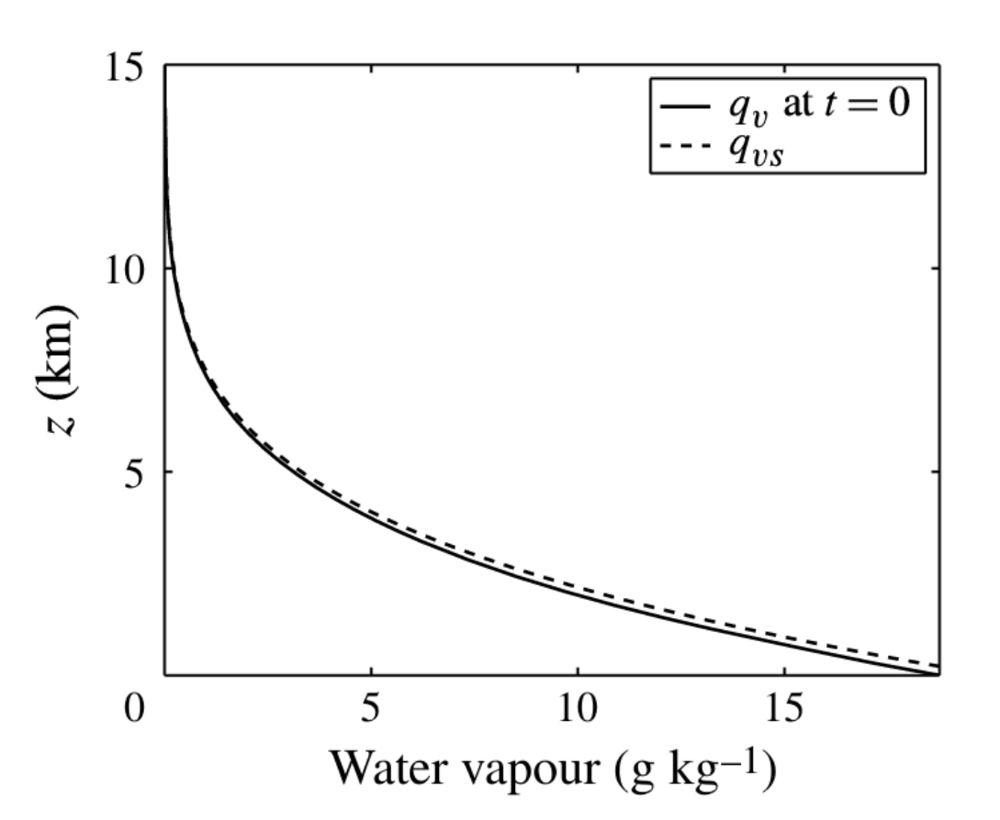
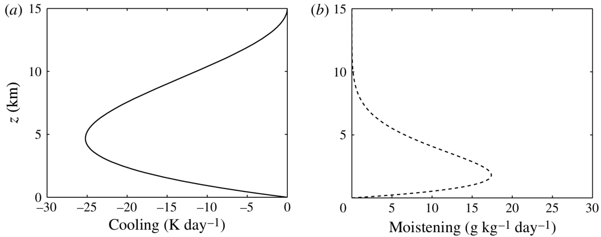
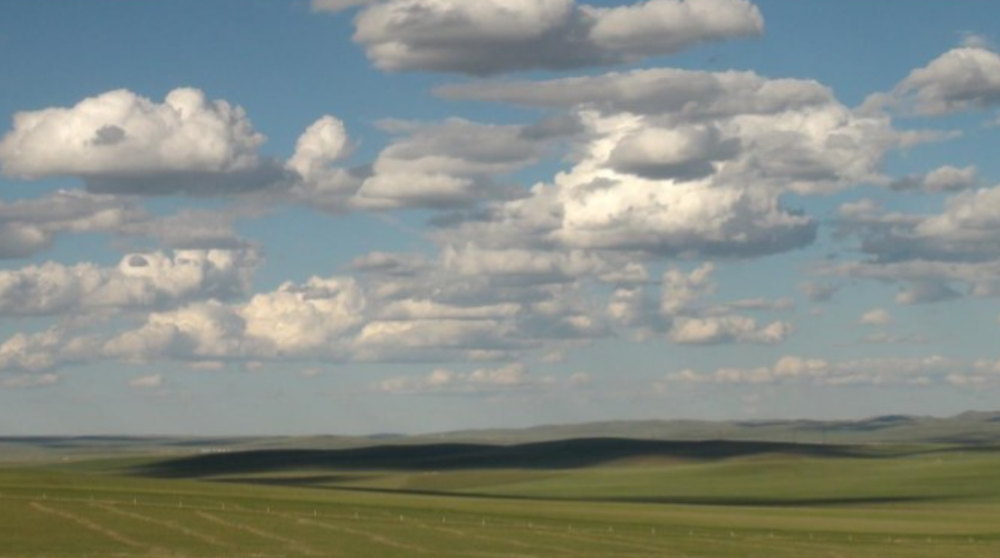
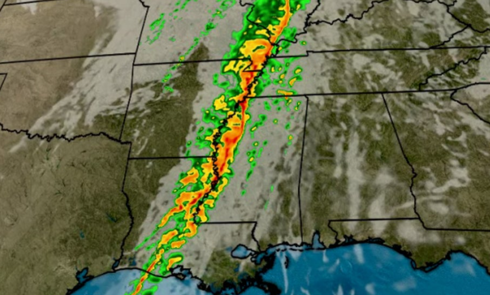
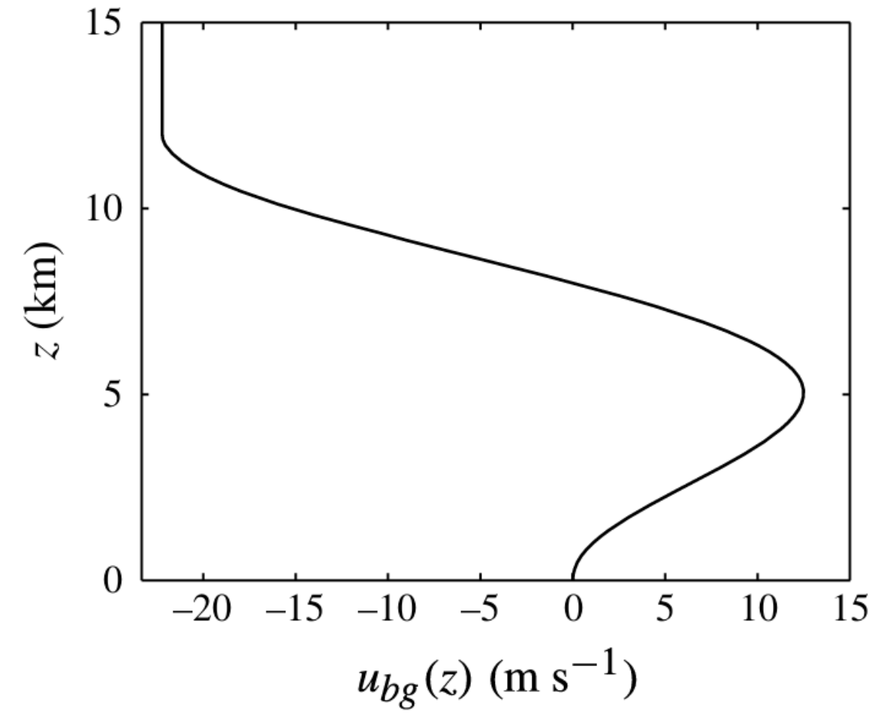
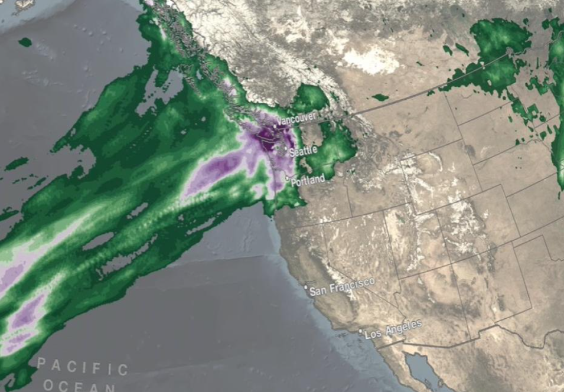
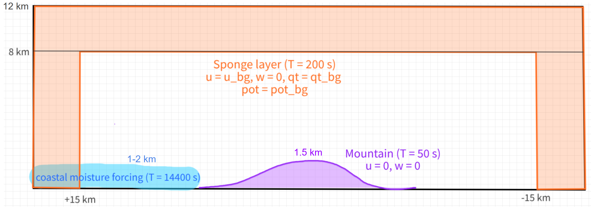
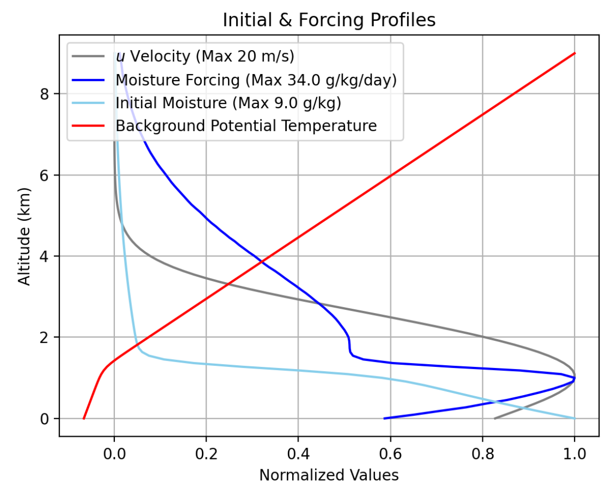
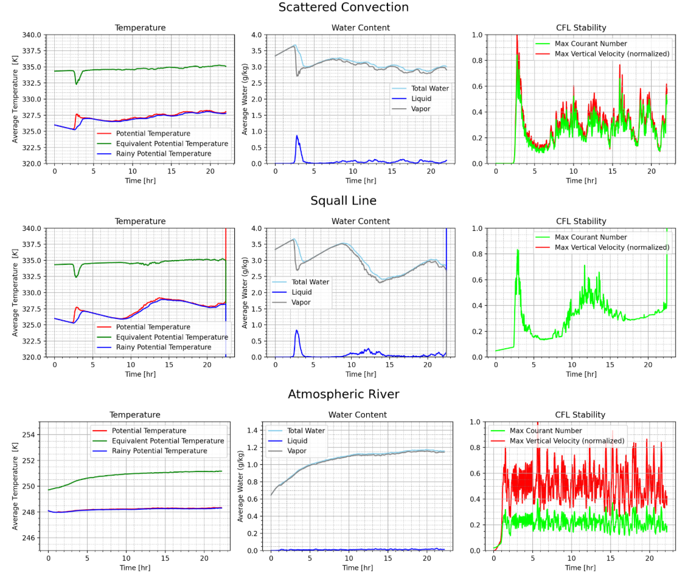

# Scenarios

The FARE package provides three idealized two-dimensional experiments: scattered convection, a squall line, and an atmospheric river. They share the FARE dynamics and numerical framework in [FORMULATION.md](FORMULATION.md), but use different background winds, moisture sources, terrain, and damping.

## Shared environmental setup

The presentation baseline uses a 256 km horizontal domain and a 15 km vertical domain with a $256\times100$ grid, $\Delta x=1$ km, $\Delta z=150$ m, and $\Delta t=2.2$ s. Its physical constants include $g=9.8\ \mathrm{m\,s^{-2}}$, $\theta_0=300$ K, $c_p=1000\ \mathrm{J\,kg^{-1}\,K^{-1}}$, $L=2.5\times10^6\ \mathrm{J\,kg^{-1}}$, and $V_T=5.5\ \mathrm{m\,s^{-1}}$.

The baseline state is initialized with a small random potential-temperature perturbation below 2 km, initially saturated or nearly saturated low-level moisture, zero rainwater, and zero vertical velocity. The shared cooling and moistening profiles provide thermodynamic forcing. The zonal wind relaxes toward zero over $\tau_u=14400$ s.

## Scattered convection (shallow_convection)

The scattered convection case starts with no imposed background wind and random near-surface temperature perturbations. Horizontally uniform cooling and moistening support moist overturning while leaving the organization to internally generated turbulence.

Create it with:

~~~
from fare_model import shallow_convection

scenario = shallow_convection()
~~~

## Squall line

The squall-line case retains the thermodynamic setup of scattered convection and relaxes towards a background zonal wind with significant vertical shear over $\tau_u=14400$ s. The background wind is

$$
u_{\mathrm{bg}}(z)=
\begin{cases}
a\left[\cos\left(\dfrac{\pi z}{H_0}\right)
-\cos\left(\dfrac{2\pi z}{H_0}\right)\right], & z<H_0,\\[8pt]
-2a, & z\ge H_0,
\end{cases}
$$

where $H_0=12$ km and $a=11.11\ \mathrm{m\,s^{-1}}$. This shear organizes the initially scattered convection into a line-like system.

Create it with:

~~~
from fare_model import squall_line

scenario = squall_line()
~~~

## Atmospheric river

The atmospheric-river configuration represents moist onshore flow over a 1.5 km mountain in a 12 km-deep domain. It combines a marine lower-tropospheric thermodynamic profile, a low-level jet, a coastal moisture source concentrated in roughly the lowest 1-2 km, and free-slip lower-boundary behavior for $u$.

To keep gravity waves and moisture from contaminating the interior, the case includes:

- an upper boundary sponge layer with a 200 s damping time;
- side sponge layers that extend 15 km inward from each lateral boundary;
- an upper sponge beginning near 8 km; and
- a terrain-adjacent mountain damping region with a 50 s time scale.

The schematic below shows the placement and purpose of these regions.

The background state combines a shallow marine boundary layer, an inversion near 1.25 km, low-level moisture, and a lower-tropospheric wind with an embedded jet, whose vertical profiles are shown:

Create it with:

~~~
from fare_model import atmospheric_river

scenario = atmospheric_river()
~~~

## Diagnostics and interpretation

The presentation tracks area-integrated temperature and water measures together with the Courant number and maximum vertical velocity. Equivalent potential temperature, $\theta_e$, is comparatively well conserved when rainwater remains small relative to vapor. CFL stability is a central practical constraint; the displayed squall-line integration eventually loses stability. Kinetic and potential energy are not expected to be tightly conserved because the experiments include external forcing, relaxation, and damping.

